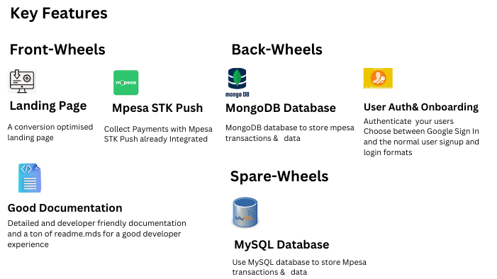
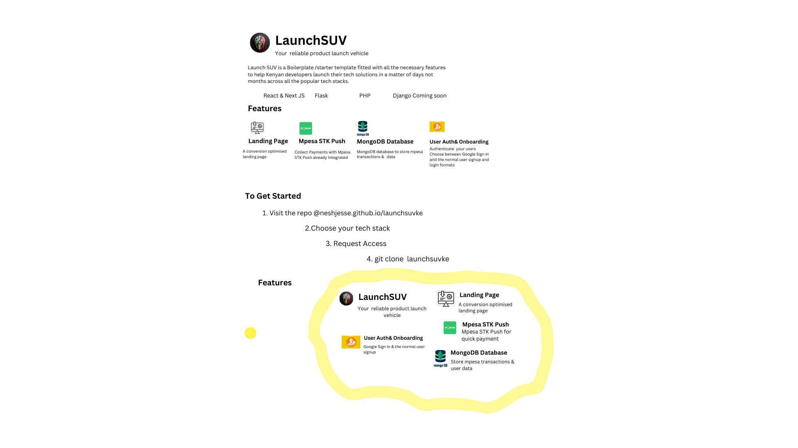

### DO NOT FORGET TO STAR THIS REPO AND FOLLOW ME
## CONTRIBUTIONS ARE ALSO OPEN

## LaunchSUV FLASK BOILERPLATE
## Launch your solution as fast as possible
The Boilerplate with all the necessary features a Kenyan developer needs to launch their side projects and commercial solutions

## FOLLOW ME ON GITHUB
 * Whatsapp me +254 702337041
 * email @ neshjesse@gmail.com
 * twitter https://x.com/itsjessenesh
 * 

1.Project Directory Structure
 * Static/
 * Templates/
 * main, mpesa ,prime paydb.py,theapp.py
 * Readme.md
 * requirements.txt

## The following flask boilerplate has three distinct python files
    
   * theapp.py has the normal signup data to be stored in mongodb
    has the mpesa data to be stored in mongodb
    has the landing page
    
   * main.py has google sign in/sign in with google implemented.To use it u have to get your credentials from the google deevelopers console online.Although implementing it requires work,we did you all the work,just  get the keys from a non testing account/assuming you are building a commercial project and fill in all the required
    details.Mpesa is already integrated within together with a working landing page for your customization.

   * mpesa.py all the logic for the mpesa stk push code.it is already integrated with all the other components,this file exists to test the mpesa stk push to see if it works,whoch it does(at least on my machine "the oldest excuse")

  *  prime.py has the normal signup form with email and password authentication,it also contains the mpesa implementation code necessary for a functioning site.

## LANDING PAGE
The landing page for this boilerplate is built using normal html and tailwind css and js.
* there is an index.html
* there is a landin.html
## choose the one that looks appealing to you

1. I f all you need is the payments and user-authentication and you have another page built with other frameworks, do what you have to do.

## PAYMENTS
The boilerplate has mpes astk push integrated, which provides the quickest and frictionless billing solution for your clients.

## USER-AUTHENTICATION
1.Choose your go to method
* GOOGLE SIGN IN/SIGN IN WITH GOOGLE
* NORMAL EMAIL AND PASSWORD
* OTP BY PHONE --COMING SOON!!

## DATABASE
1.The boilerplate is fitted with MongoDb database for easy storage of json data from the mpesa transactions,but fill free to try other ways like MYSQL OR POSTGRES,You will just need to do a few small things

## FEEL FREE TO CONTRIBUTE

